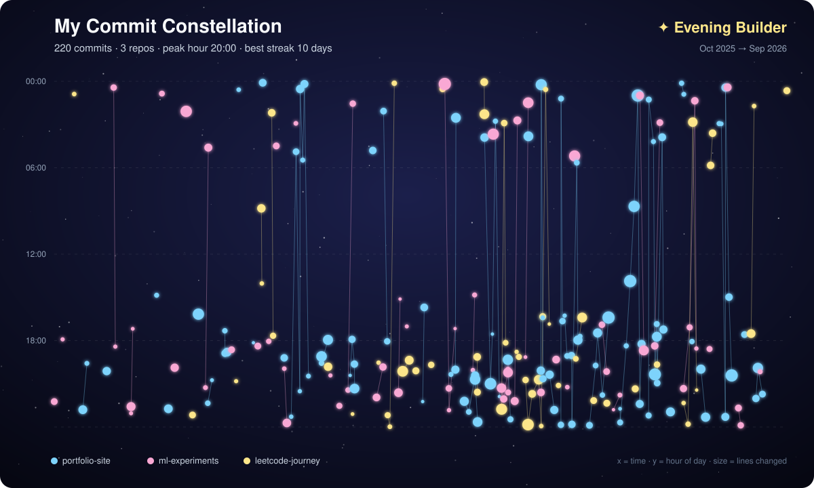

# ✦ Commit Constellation

Turn your git history into a glowing **star map**. Every commit becomes a star; commits in the same repo made close together are joined into constellations. It also reveals your coding persona: Night Owl, Early Bird and more.



## How to read the map

| Visual | Meaning |
|---|---|
| Horizontal position | When the commit happened (oldest → newest) |
| Vertical position | Hour of day (midnight at the top) |
| Star size | Lines changed in that commit |
| Colour | Repository |
| Lines | Commits in the same repo within 3 days of each other |

Hover over a star in a browser to see the repo, time, lines changed and commit message.

## Features

- Pure Python standard library: **zero dependencies**
- Scans one repo or a whole folder of repos
- Filters by author and date
- Stats: total commits, peak hour, longest daily streak, persona
- `--demo` mode to try it instantly

## Quick start

```bash
git clone https://github.com/harinisrinivasan0012-code/commit-constellation.git
cd commit-constellation

# try it with sample data
python -m commit_constellation --demo -o constellation.svg

# your real history: point it at a folder that contains your repos
python -m commit_constellation ~/projects --author "Your Name" --since "1 year ago" -o constellation.svg
```

Optional install as a command: `pip install .` then `commit-constellation --help`.

## Put it on your GitHub profile

1. Generate `constellation.svg` and commit it to your profile repo (`harinisrinivasan0012-code/harinisrinivasan0012-code`).
2. Add to that repo's `README.md`:

```markdown

```

## Run the tests

```bash
python -m unittest discover -s tests -v
```

## Ideas to extend

- GitHub API mode (fetch commits without local clones)
- GitHub Action that regenerates the SVG weekly
- Colour by programming language instead of repo

## License

MIT
